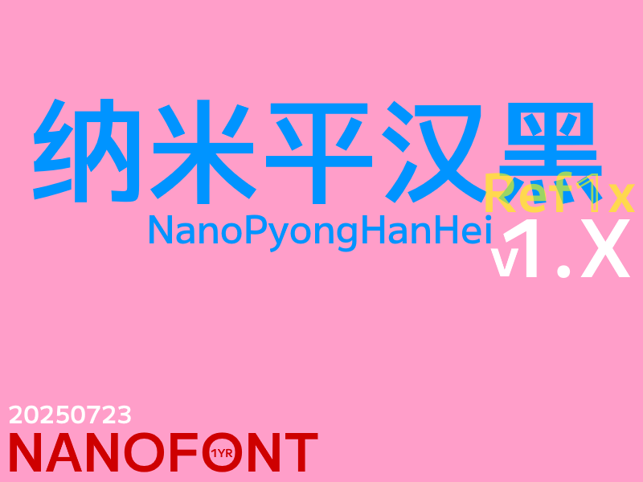
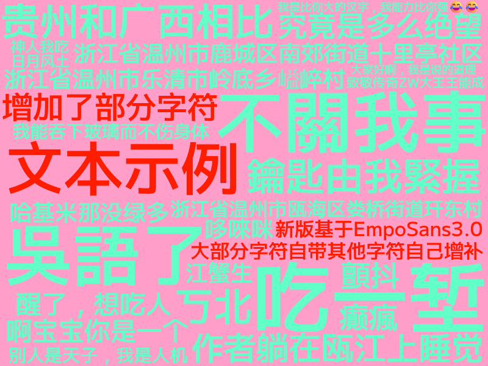
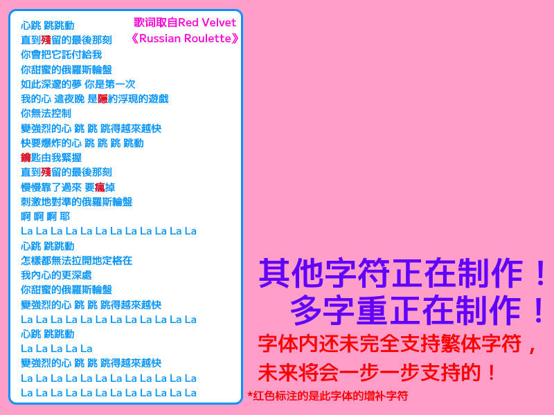
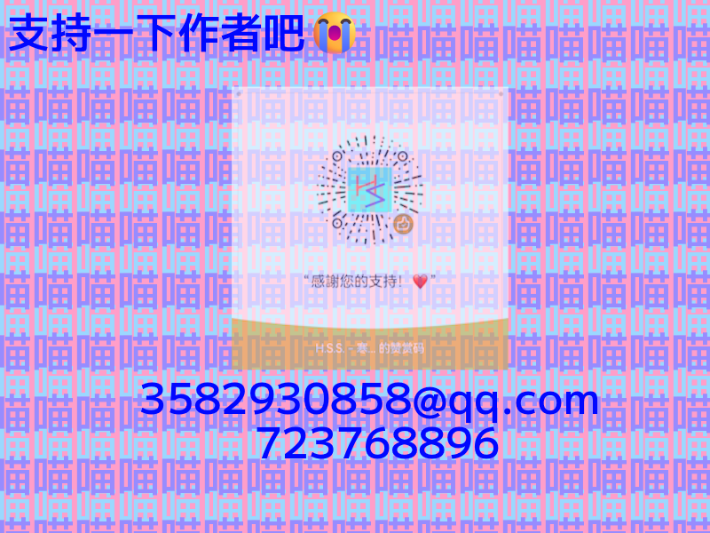

# 纳米平汉黑(NanoPyongHanHei)

## 简介

这是一款基于M+字体和EmpoSans制作的黑体补充项目

> [!IMPORTANT]
>
> 对不起让各位失望了！！多字重暂未发布，但是之后肯定会发布的，请大家耐心等待！！

## 概览

## 注意

### 字体制作有可能有一些误差，字符有可能会错误或制作不精良！

### 如有**字形优化**和**字形建议**的话请在[Issues #1](https://github.com/Hansha2011/NanoPyongHanHei/issues/1)反馈; 若是想**增加字形**的话请在[Issues #2](https://github.com/Hansha2011/NanoPyongHanHei/issues/2)请求！

## 赞助 & 联系方式 😭🙌🙌🙌

## 制作人员名单

|专项|名称|联系方式|
|-|-|-|
|制作人员|**H.S.S. - 寒沙**|3582930858@qq.com|

## 版权

本字体基于 SIL Open Font License 修改，字体本身可开源

## 加入我们

您可以加入QQ群：**723768896**，来与我们一起讨论、交流（此群为NANOFONT纳米字库交流群）

